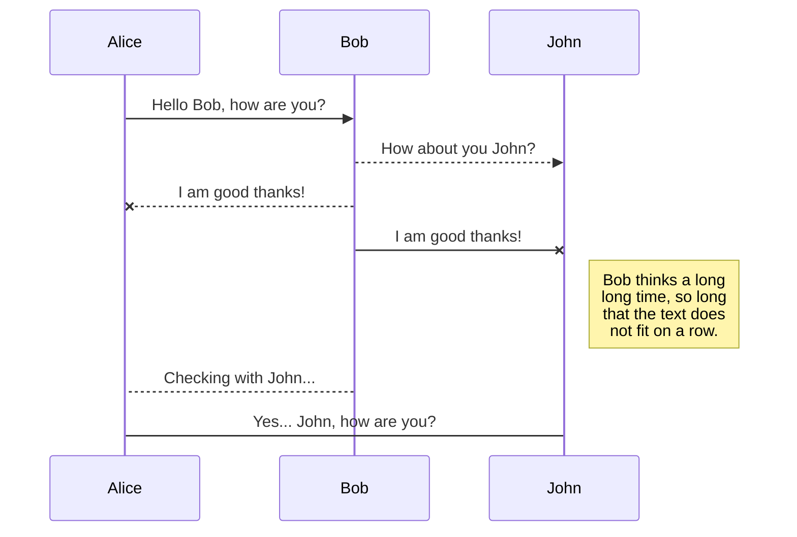

# Vehicle Tracking System

### Pre-requisites:
- Visual Studio 2019 or higher
- .net core 3.1 or higher
- Google api key

### How to run the project
+ Unzip the folder
+ Clean and rebuild the solutions
+ First, Start IdentityServer:
    * Right click on **VTS.IdentityServer** project
    * Select Debug->Start New Instance
+ Add your Google api key
  * Create a Goole api key. To know how to create one, click [here](https://developers.google.com/maps/documentation/maps-static/get-api-key).
  * In **VTS.Backend.Api** project, P=place your api key in **appsettings.Development.json** under **GoogleMapSettings** section
+ Start Backend project
    * Right click on **VTS.Backend.Api** project
    * Select Debug->Start New Instance

### Sequence diagram

